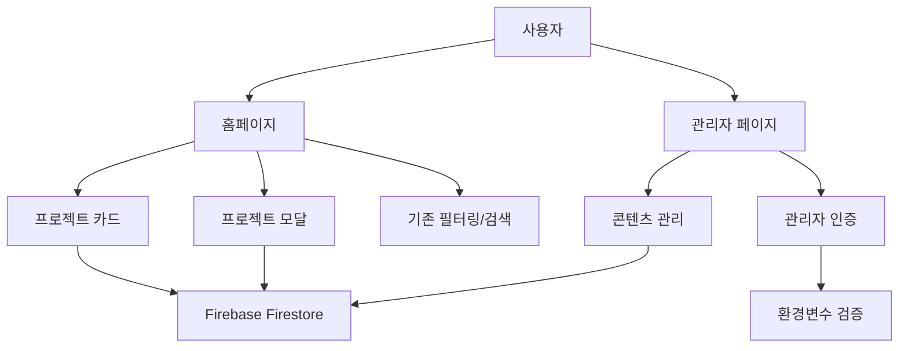
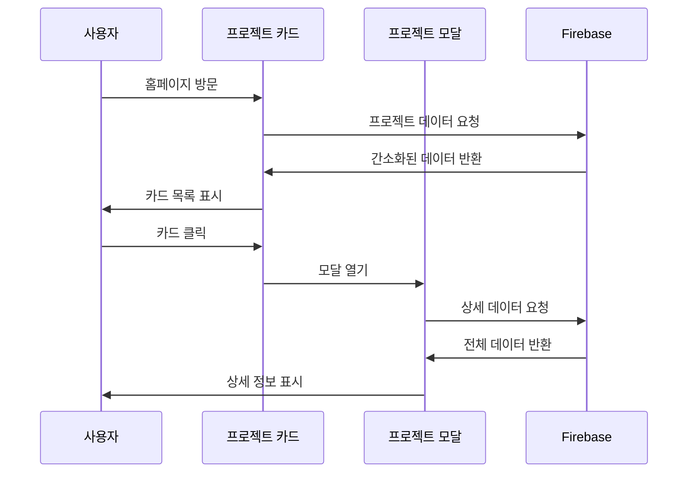

# 설계 문서

## 개요

DevCanvas 홈페이지 리뉴얼은 사용자 경험 개선과 관리 기능 추가를 목표로 합니다. 기존 시스템의 안정성을 유지하면서 프로젝트 카드 간소화, 모달 기반 상세 페이지, 관리자 페이지를 추가합니다.

## 아키텍처

### 전체 시스템 구조



### 데이터 흐름



## 컴포넌트 및 인터페이스

### 1. 프로젝트 카드 컴포넌트 (ProjectCard)

#### 기존 구조 변경
- **현재**: 모든 프로젝트 정보를 카드에 표시
- **변경 후**: 필수 정보만 표시 (썸네일, 등록일, 제목, 댓글수, 조회수)

#### 새로운 Props 인터페이스
```typescript
interface ProjectCardProps {
  project: PortfolioItemSimplified;
  onClick: (project: PortfolioItem) => void;
}

interface PortfolioItemSimplified {
  id: string;
  title: string;
  thumbnailUrl: string; // 구글 드라이브 이미지 링크
  createdAt: string;
  commentCount: number;
  viewCount: number;
}
```

### 2. 프로젝트 모달 컴포넌트 (ProjectModal)

#### 새로운 컴포넌트
```typescript
interface ProjectModalProps {
  project: PortfolioItem | null;
  isOpen: boolean;
  onClose: () => void;
}
```

#### 기능
- 전체 프로젝트 정보 표시
- ESC 키 및 외부 클릭으로 닫기
- 배경 스크롤 방지
- 반응형 디자인

### 3. 관리자 페이지 컴포넌트 (AdminPage)

#### 새로운 컴포넌트
```typescript
interface AdminPageProps {
  // 관리자 전용 페이지
}

interface AdminAuthProps {
  onAuthenticated: () => void;
}
```

#### 인증 시스템
- 환경변수 기반 인증 (VITE_ADMIN_ID, VITE_ADMIN_PW)
- 세션 기반 인증 상태 관리
- 보안 강화된 로그인 폼

## 데이터 모델

### 1. 기존 PortfolioItem 확장

```typescript
interface PortfolioItem {
  // 기존 필드들 유지
  id: string;
  title: string;
  description: string;
  category: string;
  technologies: string[];
  liveUrl?: string;
  imageUrl?: string;
  featured: boolean;
  createdAt: string;
  updatedAt?: string;
  githubUrl?: string;
  developmentTools?: string[];
  geminiApiStatus?: GeminiApiStatus;
  
  // 새로 추가되는 필드들
  thumbnailUrl: string; // 구글 드라이브 썸네일 링크
  viewCount: number;    // 조회수
  commentCount: number; // 댓글 수
}
```

### 2. 관리자 인증 모델

```typescript
interface AdminCredentials {
  id: string;
  password: string;
}

interface AdminSession {
  isAuthenticated: boolean;
  loginTime: Date;
  expiresAt: Date;
}
```

### 3. 프로젝트 통계 모델

```typescript
interface ProjectStats {
  projectId: string;
  viewCount: number;
  commentCount: number;
  lastViewed: Date;
  lastCommented: Date;
}
```

## 에러 처리

### 1. 프로젝트 데이터 로딩 에러
- 네트워크 오류 시 재시도 메커니즘
- 부분 데이터 로딩 실패 시 기본값 표시
- 사용자 친화적 에러 메시지

### 2. 모달 관련 에러
- 상세 데이터 로딩 실패 시 기본 정보 표시
- 이미지 로딩 실패 시 플레이스홀더 표시

### 3. 관리자 인증 에러
- 잘못된 자격증명 시 명확한 에러 메시지
- 세션 만료 시 자동 로그아웃
- 브루트 포스 공격 방지

## 테스팅 전략

### 1. 단위 테스트
- 프로젝트 카드 렌더링 테스트
- 모달 열기/닫기 기능 테스트
- 관리자 인증 로직 테스트

### 2. 통합 테스트
- Firebase 데이터 연동 테스트
- 모달과 카드 간 상호작용 테스트
- 관리자 페이지 전체 플로우 테스트

### 3. E2E 테스트
- 사용자 시나리오 기반 테스트
- 반응형 디자인 테스트
- 접근성 테스트

## 성능 최적화

### 1. 데이터 로딩 최적화
- 카드용 간소화된 데이터 우선 로딩
- 모달 열기 시 상세 데이터 지연 로딩
- 이미지 지연 로딩 (Lazy Loading)

### 2. 렌더링 최적화
- React.memo를 활용한 불필요한 리렌더링 방지
- 가상화를 통한 대량 카드 렌더링 최적화
- 모달 컴포넌트 조건부 렌더링

### 3. 캐싱 전략
- 프로젝트 데이터 클라이언트 사이드 캐싱
- 이미지 브라우저 캐싱 최적화
- Firebase 쿼리 결과 캐싱

## 보안 고려사항

### 1. 관리자 인증 보안
- 환경변수를 통한 자격증명 관리
- 세션 타임아웃 설정
- HTTPS 강제 사용

### 2. 데이터 보안
- Firebase 보안 규칙 강화
- 클라이언트 사이드 데이터 검증
- XSS 공격 방지

### 3. API 보안
- 구글 드라이브 이미지 링크 검증
- 외부 링크 안전성 검사
- 입력 데이터 sanitization

## 접근성 (Accessibility)

### 1. 키보드 네비게이션
- 모든 인터랙티브 요소 키보드 접근 가능
- 모달 내 포커스 트랩 구현
- 논리적인 탭 순서 보장

### 2. 스크린 리더 지원
- 적절한 ARIA 라벨 및 역할 설정
- 의미있는 대체 텍스트 제공
- 상태 변경 시 스크린 리더 알림

### 3. 시각적 접근성
- 충분한 색상 대비 보장
- 텍스트 크기 조절 지원
- 고대비 모드 지원

## 브라우저 호환성

### 지원 브라우저
- Chrome 90+
- Firefox 88+
- Safari 14+
- Edge 90+

### 폴백 전략
- 구형 브라우저용 기본 스타일 제공
- JavaScript 비활성화 시 기본 기능 유지
- 이미지 로딩 실패 시 텍스트 대체

## 배포 및 모니터링

### 1. 배포 전략
- 점진적 배포 (Feature Flag 활용)
- A/B 테스트를 통한 사용자 반응 측정
- 롤백 계획 수립

### 2. 모니터링
- 페이지 로딩 성능 모니터링
- 에러 발생률 추적
- 사용자 행동 분석

### 3. 유지보수
- 정기적인 보안 업데이트
- 성능 최적화 지속적 개선
- 사용자 피드백 반영